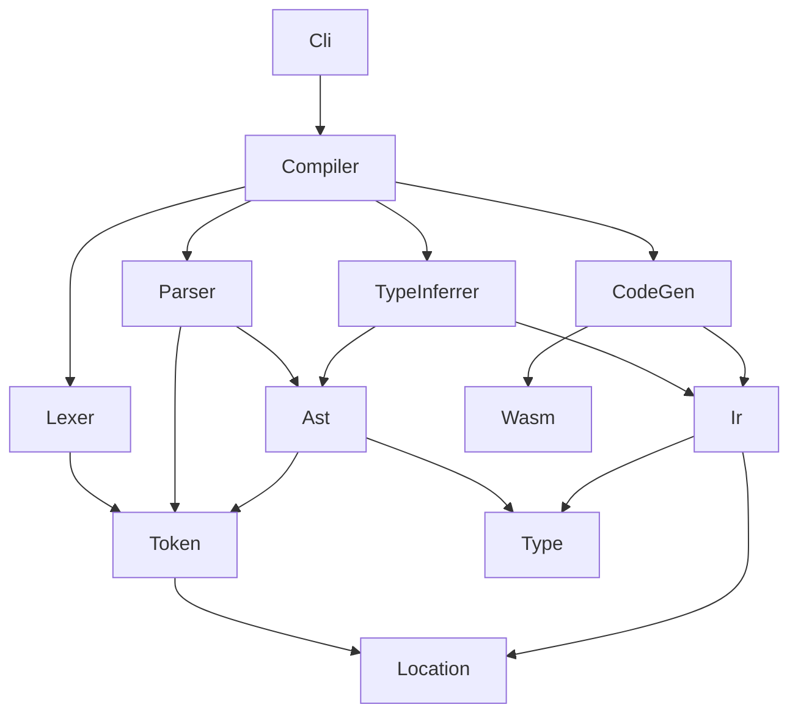

# WAXT - WebAssembly eXtended Text Format

WAT (WebAssembly Text Format) を少し拡張して、人間にとって書きやすく malloc / free や GC の実装で役立つことを目指した中間レベルの言語です。

コンパイラを用いて WASM (バイナリ形式) に変換して、各種 WASM ランタイムで実行できます。

## 実装したい言語機能

### トップレベルでの関数定義

WAXT :

```kotlin
export fun add_and_store(addr: i32, x: i22, y: i32) {
    i32_store(addr, x + y)
}
```

WAT (コンパイル後) :

```wasm
(module
    (memory 1)
    (func (export "add_and_store")
        (param $addr i32) (param $x i32) (param $y i32)
        (i32.store
            (local.get $addr)
            (i32.add (local.get $x) (local.get $y)))))
```

### 引数・`let` 束縛

デフォルトですべての引数・`let` 束縛はイミュータブルであり、代入はコンパイルエラーとなります。引数・`let` 束縛に `mut` キーワードを付与するとミュータブルとなり、代入が許可されます。代入には `<-` キーワードを使用します。

```kotlin
fun foo(x: i32, mut y: i32): i32 {
    // x <- x + 1;       // compile error
    y <- y + 1;          // updates value of `y`

    let x2 = x + 2;      // new let binding (immutable)
    // x2 <- x2 + 3;     // compile error

    let mut y4 = y + 2;  // new let binding (mutable)
    y4 <- y4 + 1;

    let x = x2 + 3;      // shadowing

    let y = y4 + 4;

    x * y  // (x + 5) * (y + 8)
}
```

## テストの実行方法

```bash
dotnet test
```

## カバレッジの計測方法

```bash
./coverage.sh
```

## プロジェクトの依存関係


