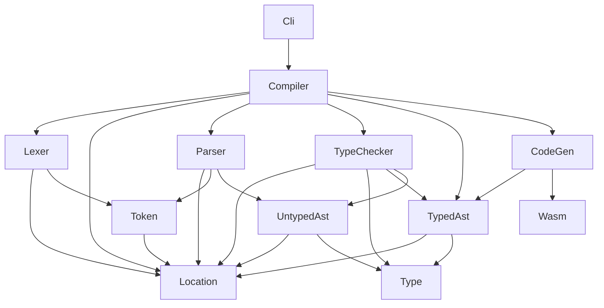

# WAXT - WebAssembly eXtended Text Format

WAT (WebAssembly Text Format) を少し拡張して、人間にとって書きやすく malloc / free や GC の実装で役立つことを目指した中間レベルの言語です。

WAT と同じく S 式で記述し、コンパイラを用いて WASM (バイナリ形式) に変換したうえで、各種 WASM ランタイムで実行できます。

## 開発状況

``i32.add``, `i32.mul`, ``i32.store`` を用いた単純な関数定義をコンパイルできるようにしました。

これから `let`, `set!` 特殊形式と型推論を実装しようとしています。

## 実装したい言語機能

### トップレベルでの関数定義

WAXT :

```wasm
(func add-and-store ([addr : i32] [x : i32] [y : i32])
    (i32.store addr (+ x y)))
```

WAT (コンパイル後) :

```wasm
(module
    (memory 1)
    (func $add-and-store (export "add-and-store")
        (param $addr i32) (param $x i32) (param $y i32)
        (i32.store
            (local.get $addr)
            (i32.add (local.get $x) (local.get $y)))))
```

### 定数

デフォルトですべての引数・束縛はイミュータブルであり、再代入はコンパイルエラーとなります。

```wasm
(func foo i32 ([x : i32] [y : i32])
    (let [x' (+ x 2) y' (+ y 3)]
        (* x' y')))
```

### 変数

`$` プレフィックス付きの引数・束縛はミュータブルとなり、 `set!` 特殊形式による再代入が許可されます。

```wasm
(func bar i32 ([$x : i32] [$y : i32])
    (set! $x (+ $x 2))
    (set! $y (+ $y 3))
    (* $x $y))
```

## コード例の実行方法

`example` ディレクトリ内にコード例があり、それらは以下のコマンドでコンパイルできます。

```bash
dotnet run --project src/Waxt.Cli -- example/noop.waxt

dotnet run --project src/Waxt.Cli -- example/return-i32.waxt

dotnet run --project src/Waxt.Cli -- example/add-and-store.waxt
```

## テストの実行方法

```bash
./test.sh
```

## プロジェクトの依存関係


