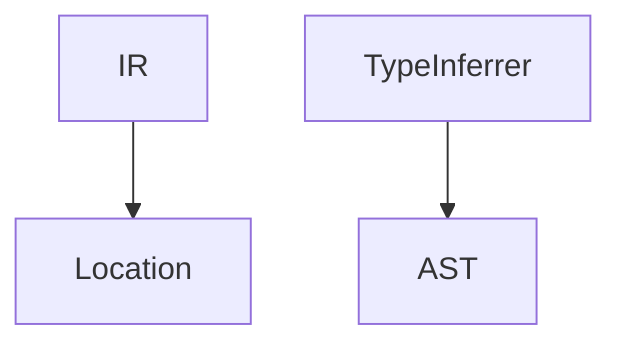

# WAXT - WebAssembly eXtended Text Format

WAT (WebAssembly Text Format) を少し拡張して、人間にとって書きやすく malloc / free や GC の実装で役立つことを目指した中間レベルの言語です。

コンパイラを用いて WASM (バイナリ形式) に変換して、各種 WASM ランタイムで実行できます。

## 実装したい言語機能

### トップレベルでの関数定義

WAXT :

```text
export func add_and_store(addr: i32, x: i22, y: i32) {
    i32_store(addr, x + y)
}
```

WAT (コンパイル後) :

```wasm
(module
    (memory 1)
    (func (export "add_and_store")
        (param $addr i32) (param $x i32) (param $y i32)
        (i32.store
            (local.get $addr)
            (i32.add (local.get $x) (local.get $y)))))
```

### 定数

デフォルトですべての引数・束縛はイミュータブルであり、再代入はコンパイルエラーとなります。

```text
func foo(x: i32, y: i32) -> i32 {
    let x' = x + 2
    let y' = y + 3
    // y <- y + 3 // compile error
    x' * y'
}
```

## テストの実行方法

```bash
dotnet test
```

## カバレッジの計測方法

```bash
./coverage.sh
```

## プロジェクトの依存関係


